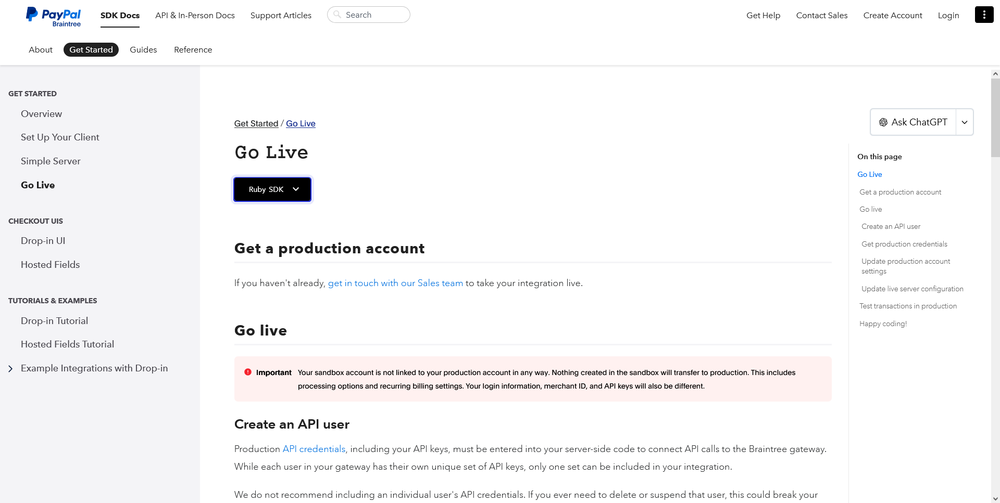
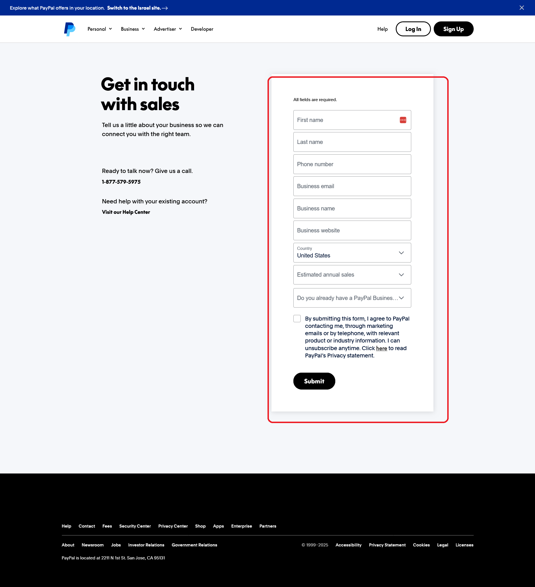
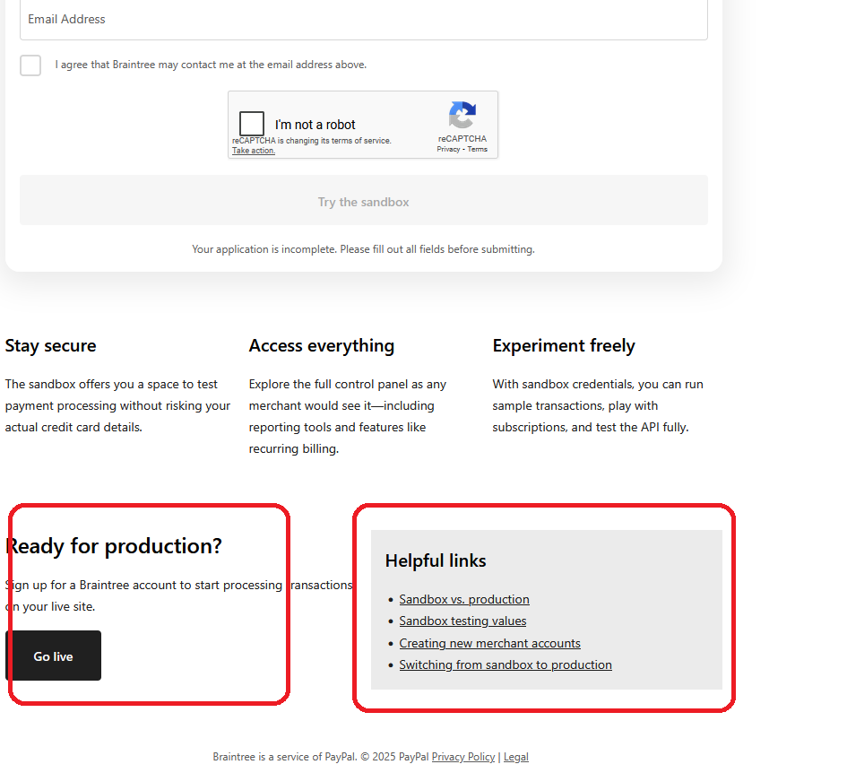
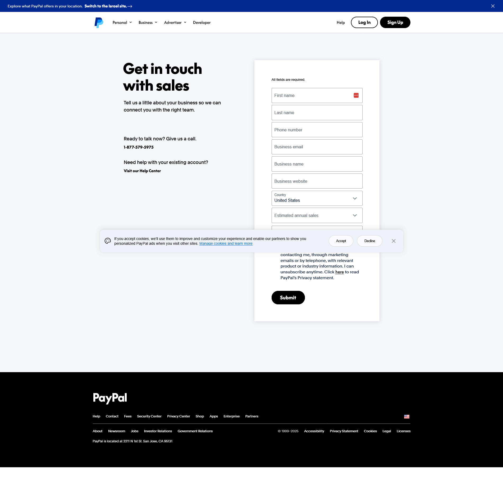
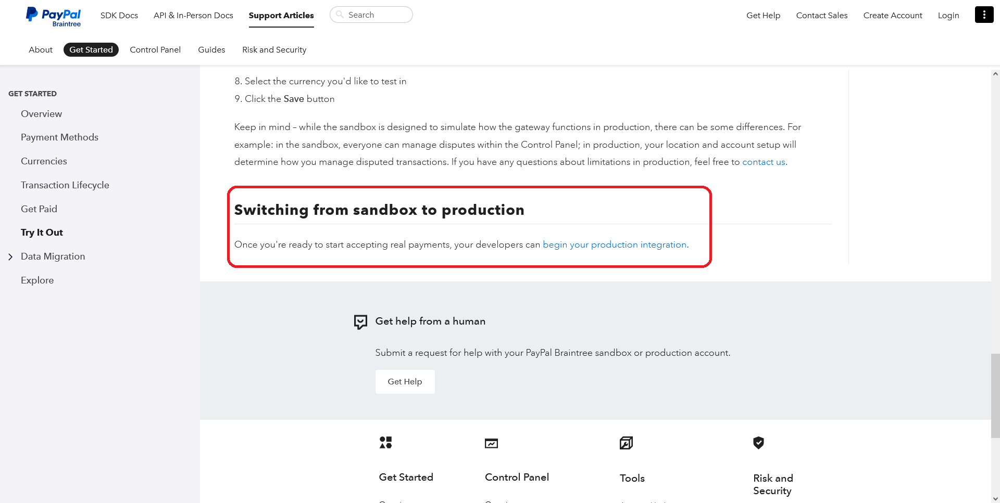

<h1>Project Name</h1>
....

<h2>Project Description</h2>
....

<h2>Motivation</h2>
getting braintree sandox keys and merchant id is easy , but getting them for live (production) is nightmare

<h2>Key Takeaways</h2>
<ul>
    <li>going live on braintree require approval from their team</li>
   
</ul>

<h2>Installation</h2>
go live \ get production account

click <a href='https://www.paypal.com/us/business/contact-sales?utm_campaign=Braintree_Migration&utm_medium=Website&utm_source=Braintree'>get in touch with our sales team</a> and you will need to fill the form  and submit which i did 10-11-25 at about 10AM and i wait for answer

<h2>Usage</h2>
navigate to the page of <a href='https://apply.braintreegateway.com/signup/sandbox?utm_campaign=Braintree_Migration&utm_medium=Website&utm_source=Braintree'>Create a Braintree Sandbox Account</a> scroll down and click on Go Live 

Click on it i am nagigated to pure paypal page - nothing about braintree here !

but there are some links below in the first image

click on 'sandbox vs production' and you will be navigated to  here click on <a href='https://developer.paypal.com/braintree/docs/start/go-live/ruby/'> begin your production integration</a>

<h2>Technologies Used</h2>
....

<h2>Design</h2>
....

<h2>Code Structure</h2>
....

<h2>Demo</h2>
....

<h2>Points of Interest</h2>
<ul>
    <li>...</li>
   
</ul>

<h2>open issue</h2>
<ul>
    <li>which type of paypal account is requiredd to use braintree : buisness or not<li>
    <li>it seems that you can get live account only via <a href='https://www.paypal.com/us/business/contact-sales?utm_campaign=Braintree_Migration&utm_medium=Website&utm_source=Braintree'>this link</a> this is <li>
   
</ul>

<h2>References</h2>
<ul>
    <li id='ref1'><a href='https://github.com/NathanKr/paypal-poc'>paypal poc</a></li>
    <li><a href='https://developer.paypal.com/braintree/articles/'>https://developer.paypal.com/braintree/articles/</a></li>
    
</ul>

