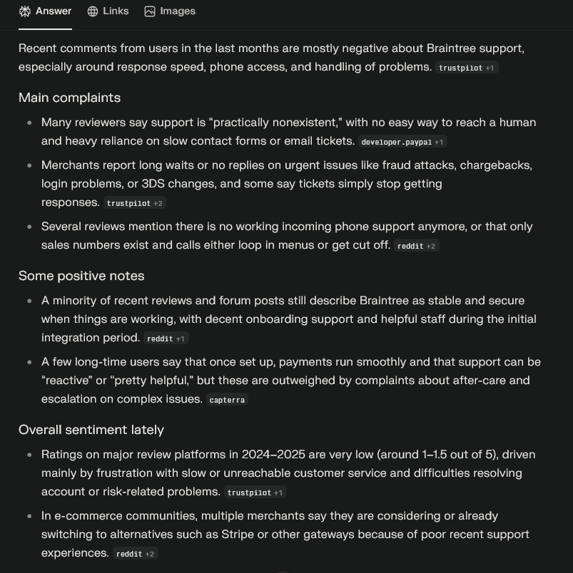
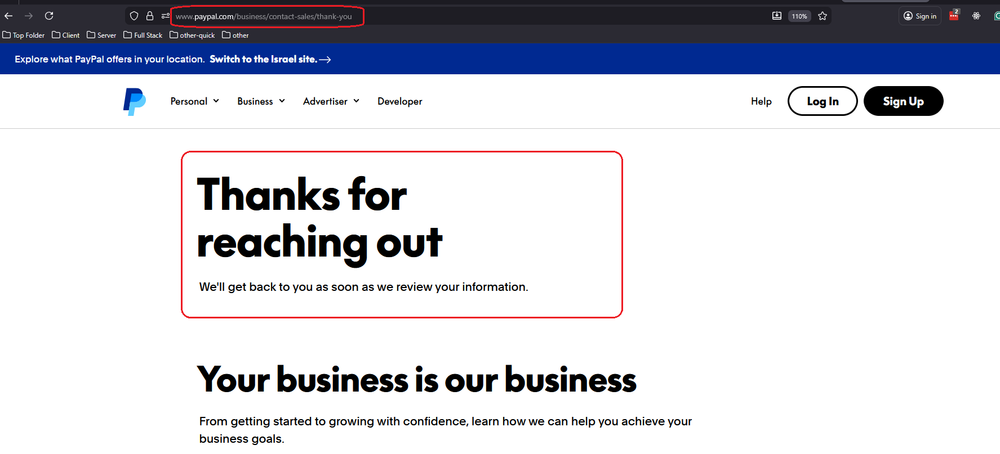

# Braintree Production Keys: The Undocumented Maze

## Project Description
This repository documents my experience attempting to obtain **Braintree production (live) API keys**.  
Despite a smooth sandbox integration, the process of going live was unexpectedly difficult.  
Based on the behavior I encountered, it appears that **new merchants may no longer be a priority in Braintree’s onboarding pipeline**.

## Motivation
I planned to use Braintree to implement payment processing for **Post2Video**, my SaaS product.

## My Experience
- Spent several weeks learning the Braintree SDK and reading official documentation  
- Successfully integrated Braintree into Post2Video  
- Built a fully working sandbox POC (`paypal-poc`)  
- Reached the final step: obtaining production keys  
- Submitted the “Contact Sales” form:
  - **10 Nov 2025** — submission ended with a page error  
  - **13 Nov 2025** — submission succeeded  
- As of **3 Dec 2025**, I have received **no reply at all**  
- Ultimately, I had to remove all Braintree-related code and switch to a manual PayPal integration  
- Result: several weeks of development time lost

## Key Takeaways
- Getting sandbox keys and a sandbox merchant ID is easy  
- Getting *production* access is **unclear, slow, and appears unsupported**  
- For new projects, I cannot recommend starting with Braintree unless you already have a direct sales contact

## Community Sentiment (External Research)
To confirm my experience was not isolated, I searched for recent user feedback on **3 Dec 2025**.  
Using Perplexity AI, I collected summaries of recent discussions and reviews.

The findings match my experience:

### Main Complaints
- Support described as “practically nonexistent” or extremely slow  
- No reliable way to reach a human—phone lines reportedly non-functional or looping  
- Long delays on urgent issues (fraud, 3DS, chargebacks, access problems)  
- Merchants expressing frustration that communication happens only via slow email tickets

### Overall Sentiment
- Review platforms in **2024–2025** show very low ratings (≈ 1–1.5 / 5), mostly due to support  
- Many merchants publicly state they are migrating to alternatives such as Stripe

Here is the screenshot of the Perplexity AI summary that supports these findings:

---

## Installation / Attempt to Go Live

The following sections document the various paths I tried to obtain production credentials. Each path either led to a dead end, an
unresponsive contact form, or a redirect away from Braintree. This shows the circular maze developers encounter when trying to go live.

### 1. Go Live / Get Production Account
Here is the “Get Production Account” section as shown on the Braintree site:

### 2. Contacting Sales Through PayPal
You are directed to this contact form:
https://www.paypal.com/us/business/contact-sales?utm_campaign=Braintree_Migration&utm_medium=Website&utm_source=Braintree

Here is what the form looks like:

On **10 Nov 2025**, the form ended with an error.  
On **13 Nov 2025**, the form submitted successfully.  
Here is the confirmation message from the successful submission:

### 3. Attempting the Sandbox → Production Path
Here is the sandbox page where developers expect to find a path to production:

When clicking **Go Live**, instead of Braintree onboarding, you are redirected to a generic PayPal page:

### 4. Sandbox vs Production Link Path
Here is the “Sandbox vs Production” documentation page that appears below the earlier section:

It directs you to a “Begin Your Production Integration” page, but provides **no path to actually request or obtain production credentials**.

---

## References
- https://developer.paypal.com/braintree/articles/  
- **My POC walkthrough video:** https://youtu.be/6u0aroHdIpM
